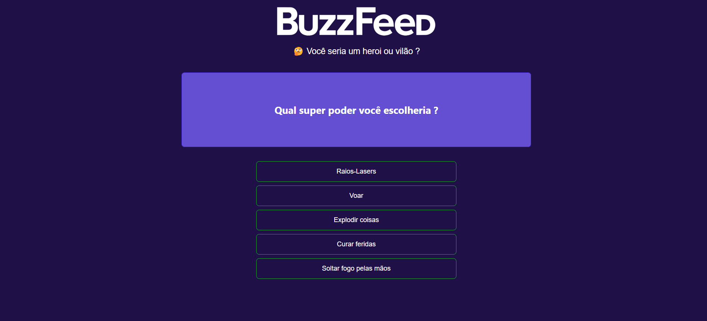
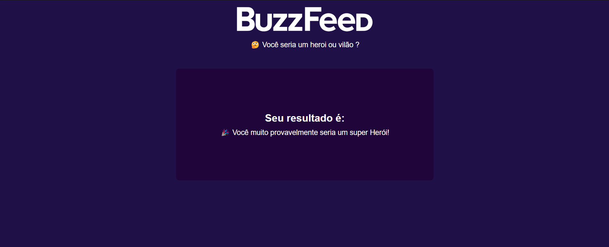

<h1 align="center">BuzzFeed - Clone</h1>

	Projeto desenvolvido com Angular e TypeScript durante <a href="https://www.dio.me/bootcamp/coding-future-banco-pan-desenvolvimento-frontend-com-angular" target="_blank">BOOTCAMP</a> promovido pela 
	<a href="https://www.dio.me/" target="_blank">DIO</a> e pelo <a href="https://www.bancopan.com.br/" target="_blank">BANCO PAN</a> e ministrado pelo 
	<a href="https://github.com/felipeAguiarCode" target="_blank">Felipe Aguiar</a> 
 

 

  
   
   
  

## 🚀 Tecnologias

Esse projeto foi desenvolvido com as seguintes tecnologias:

- HTML
- Saas (scss)
- TypeScript
- Git e Github
- Angular

## 🗺️ Roadmap

O projeto é a aplicação prática de todo o conteúdo ministrado durante o bootcamp, onde fiz algumas customizações pessoais mantendo o design sugerido nas aulas.

- Análise estrutural para uso dos componentes
- Criação e estilização dos componentes do BuzzFeed com Saas

Feito com ♥ by Nelson Soares